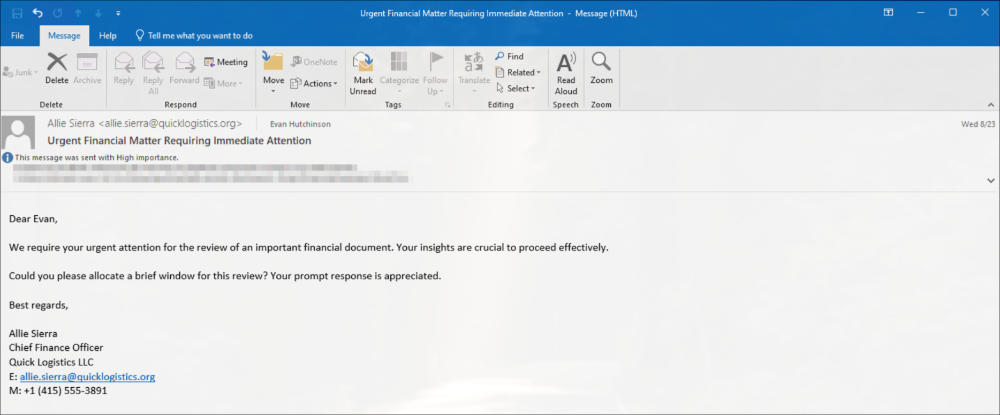
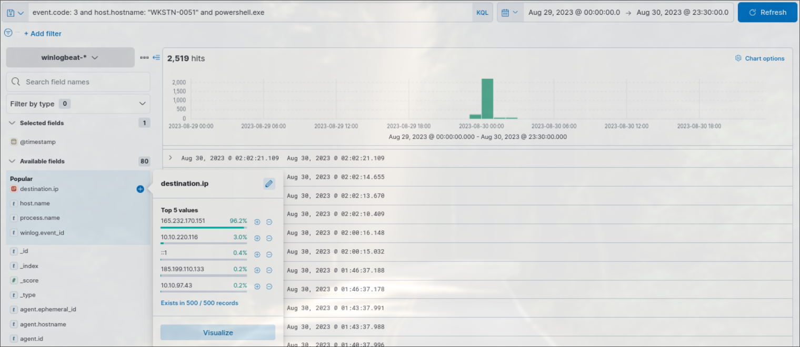
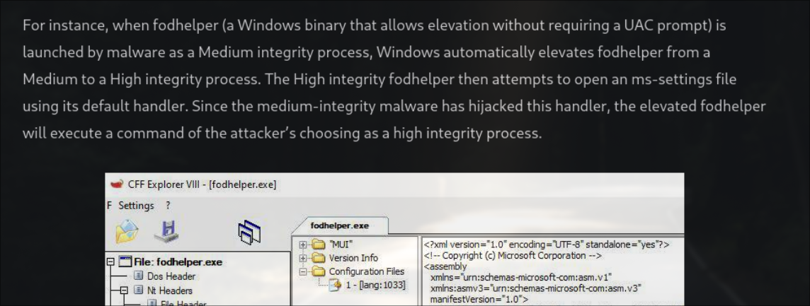
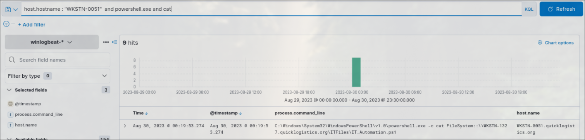
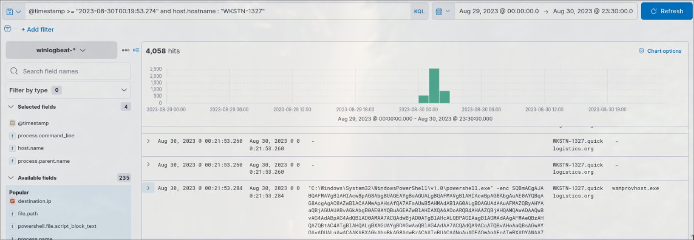
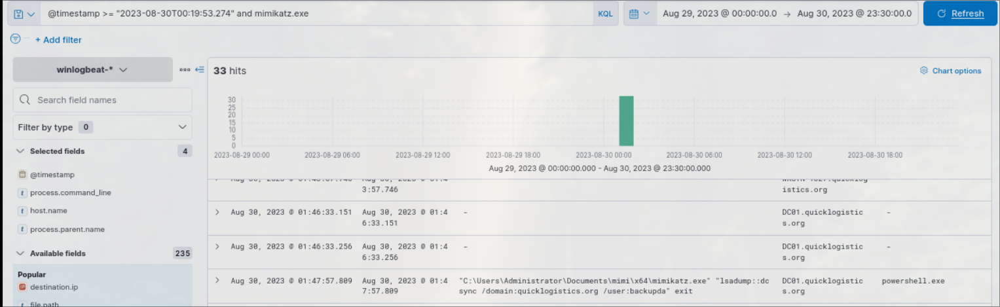

*Due to the previous attacks of Boogeyman, Quick Logistics LLC hired a managed security service provider to handle its Security Operations Center. Little did they know, the Boogeyman was still lurking and waiting for the right moment to return.*

In this room, you will be tasked to analyse the new tactics, techniques, and procedures (TTPs) of the threat group named Boogeyman.

The analyst should be familiar with phishing, sysmon and ELK (elastic stack).

Join the room [Boogeyman 3](https://tryhackme.com/room/boogeyman3) and start the machine, type the IP in the address bar of your VMs browser. Username: elastic, password: elastic.
### Phishing case
The Boogeyman compromised one of the employees and stayed hidden, waiting for the perfect moment to attack. The threat actor attempted spear phishing by targeting the CEO Evan Hutchinson.

Evan opened the attachment, after which, he reported the phishing email to the security team.
### Initial investigation
Upon receiving the phishing report the security team investigated the workstation of the CEO, where they found the email attachment in the downloads folder called **ProjectFinancialSummary_Q3.pdf**. They also observed a file inside the ISO payload with the same name. Lastly the team concluded that the incident occurred between **August 29 and August 30, 2023**.

### Questions
>1. What is the PID of the process that executed the initial stage 1 payload?

Ans: 6392

First we search for the known file **ProjectFinancialSummary_Q3** by typing \*ProjectFinancialSummary_Q3\* in the query field. From here we can note some data we can use in our investigation, such as: `host.hostname` -> WKSTN-0051 and `host.ip` -> 10.10.155.159. The answer to the question can be found in the `process.pid` field of the forth log.

>2. The stage 1 payload attempted to implant a file to another location. What is the full command-line value of this execution?

Ans: `"C:\Windows\System32\xcopy.exe" /s /i /e /h D:\review.dat C:\Users\EVAN~1.HUT\AppData\Local\Temp\review.dat`

If we look at the third log we can find a `process.name` called **xcopy.exe**. It's self explanatory that the `process.command_line` field contains the answer to this question. The implanted file's name is `review.dat` which will be useful in later questions.

>3. The implanted file was eventually used and executed by the stage 1 payload. What is the full command-line value of this execution?

Ans: `"C:\Windows\System32\rundll32.exe" D:\review.dat,DllRegisterServer`

Looking at the second log's `process.command_line` we can find the answer to this question. We see that the threat actor registered a DLL within the ISO.

> 4. The stage 1 payload established a persistence mechanism. What is the name of the scheduled task created by the malicious script?

Ans: Review

Looking at the first log where the threat actor establishes persistence with the Task Scheduler. In the `process.command_line` field we can see the command ran -> `"C:\Windows\System32\WindowsPowerShell\v1.0\powershell.exe" $A = New-ScheduledTaskAction -Execute 'rundll32.exe' -Argument 'C:\Users\EVAN~1.HUT\AppData\Local\Temp\review.dat,DllRegisterServer'; $T = New-ScheduledTaskTrigger -Daily -At 06:00; $S = New-ScheduledTaskSettingsSet; $P = New-ScheduledTaskPrincipal $env:username; $D = New-ScheduledTask -Action $A -Trigger $T -Principal $P -Settings $S; Register-ScheduledTask Review -InputObject $D -Force;`. The task executes `rundll32` to register the file tranferred via `xcopy`.

> 5. The execution of the implanted file inside the machine has initiated a potential C2 connection. What is the IP and port used by this connection? (format: IP:port)

Ans: `165.232.170.151:80`

If we look at the sysmon event IDs, we see that ID 3 is used for netowork connections. However if we search for `event.code: 3` we get 21,362 hits. Narrowing the search with `host.hostname: "WKSTN-0051"` doesn't help as we get 16,740 hits. Let's try searching for `powershell.exe` as we've seen the threat actor use it previously. Now we get 2,519 hits, much better. Let's look at the destination IP field to see the most common values. Notice we have 5 IPs. 2 local ones (not suspicious), 1 loopback IPv6, and two adresses that look suspicious. First one is `185.199.110.133`, let's investigate. Destination hostname leads to github.com which doesn't make the IP suspicious, however the threat actor probably used GitHub to download necessary software for malware execution. 

Let's look at the other one, `165.232.170.151`. It has many more logs, and it's suspicious that the CEO's workstation would connect to an external IP using powershell. This must be the threat actor's IP. Let's remember it for future reference.

Now let's filter with the suspicious IP and check the `destination.port` field to answer the question fully. It contains only one value so we're covered.

>6. The attacker has discovered that the current access is a local administrator. What is the name of the process used by the attacker to execute a UAC bypass?

Ans: `fodhelper.exe`

User access control bypass information can be find on the official elastic page, where we can find different methods such as registry key manipulation, DLL hijack, elevated COM interface. Searching for the previously found implanted file `review.dat` we get 39 hits. Let's show `process.command_line` fields to investigate more easily. We see discovery activity such as `whoami` and `net` commands to enumerate permissions. Another one is `fodhelper.exe`, looks suspicious. On the elastic UAC bypasses page we can find that **fodhelper** is a windows binary that allows elevation without a UAC prompt.

>7. Having a high privilege machine access, the attacker attempted to dump the credentials inside the machine. What is the GitHub link used by the attacker to download a tool for credential dumping?

Ans: `https://github.com/gentilkiwi/mimikatz/releases/download/2.2.0-20220919/mimikatz_trunk.zip`

We have previous knowledge of GitHub being used so let's run a search query for github.com and let's show the `process.command_line `field for easier investigation. We see multiple logs containing `https://github.com/gentilkiwi/mimikatz/releases/download/2.2.0-20220919/mimikatz_trunk.zip`. Entering the GitHub page and reading the README we see:
*"It's now well known to extract plaintexts passwords, hash, PIN code and kerberos tickets from memory."*
This must be the external tool downloaded. Remember it's name for later questions.

>8. After successfully dumping the credentials inside the machine, the attacker used the credentials to gain access to another machine. What is the username and hash of the new credential pair? (format: username:hash)

Ans: `itadmin:F84769D250EB95EB2D7D8B4A1C5613F2`

The tool downloaded is **mimikatz** so let's try search for `mimikatz.exe` to find the username and hash. We see 40 logs, but let's narrow our search by filtering for the CEO's Workstation. Now we get 7 hits. 

The threat actor dumps the credentials for users recently logged on to the workstation by exposing their hashes. After which the attacker passes the hash using the NTLM hash of the exposed `itadmin` user.

>9. Using the new credentials, the attacker attempted to enumerate accessible file shares. What is the name of the file accessed by the attacker from a remote share?

Ans: `IT_Automation.ps1`

I spent a lot of time looking at logs with `user.name: itadmin` but that doesn't get us far. Next let's search for CEO's workstation and `powershell.exe`. We get 2986 hits, very unreadable. Since the attacker enumerated file shares let's try searching for the `cat` command as well. Selecting the `process.comand_line` field we see the file name displayed in multiple logs.

>10. After getting the contents of the remote file, the attacker used the new credentials to move laterally. What is the new set of credentials discovered by the attacker? (format: username:password)

Ans: `QUICKLOGISTICS\allan.smith:Tr!ckyP@ssw0rd987`

Let's use the previous questions timestamp to find out what credential the threat actor discovered -> `@timestamp >= "2023-08-30T00:19:53.274"`. Sort the timestamp descending for easier readability. After some scrolling we find the credentials from the powershell command -> `"C:\Windows\System32\WindowsPowerShell\v1.0\powershell.exe" -c "$credential = (New-Object PSCredential -ArgumentList (" "QUICKLOGISTICS\allan.smith, (ConvertTo-SecureString Tr!ckyP@ssw0rd987 -AsPlainText -Force))) ; Invoke-Command -Credential $credential -ComputerName WKSTN-1327 -ScriptBlock {whoami}"`.

>10. What is the hostname of the attacker’s target machine for its lateral movement attempt?

Ans: `WKSTN-1327`

Read the log from the previous question to find the workstation name, as it's revealed in the `-ComputerName` argument.

>11. Using the malicious command executed by the attacker from the first machine to move laterally, what is the parent process name of the malicious command executed on the second compromised machine?

Ans: `wsmprovhost.exe`

Using the same timestamp from the previous question in the search query with the newfound `host.hostname`. Select the `process.parent.name` field for easier reading. After scrolling we find an encoded powershell command and it's parent command.

>12. The attacker then dumped the hashes in this second machine. What is the username and hash of the newly dumped credentials? (format: username:hash)

Ans: `administrator:00f80f2538dcb54e7adc715c0e7091ec`

From previous knowledge we know the threat actor used `mimikatz.exe` to dump hashes, so let's use that to our advantage. Keep the timestamp search query from previous questions as well as the hostname and search for `mimikatz.exe`. We see the previous hashdump which we already discused so let's keep scrolling. We find the command used which contains the new username and the hash.

>13. After gaining access to the domain controller, the attacker attempted to dump the hashes via a DCSync attack. Aside from the administrator account, what account did the attacker dump?

Ans: backupda

Since we know the threat actor gained access to the DC, we can remove the workstation from the search query and look for the next hashdump coming from the DC workstation.

>14. After dumping the hashes, the attacker attempted to download another remote file to execute ransomware. What is the link used by the attacker to download the ransomware binary?

Ans: http://ff.sillytechninja.io/ransomboogey.exe

We now know the DC hostname from the previous question so use it in the search query. We can also use the timestamp of the `mimikatz.exe` command from the previous question to find later logs. Let's also use the `"*http*" and event.code: 1` to filter out for http/https logs and sysmon process creation. From here we can see logs displaying the URL needed for this question

### Summary
The Boogeyman threat actor targeted Quick Logistics LLC's CEO Evan Hutchinson via a spear phishing email containing a malicious ISO payload disguised as `ProjectFinancialSummary_Q3.pdf`. The stage 1 payload (PID: 6392) implanted `review.dat` via `xcopy.exe` and executed it using `rundll32.exe`, while establishing persistence through a scheduled task named **Review**. A C2 channel was opened to `165.232.170.151:80`, after which the attacker confirmed local administrator access and bypassed UAC using `fodhelper.exe`. Mimikatz was downloaded from GitHub to dump credentials, yielding the `itadmin` NTLM hash used for lateral movement to `WKSTN-1327`. On the second machine, the `administrator` hash was dumped with `wsmprovhost.exe` as the parent process, and the attacker pivoted to the Domain Controller to perform a DCSync attack, compromising the `backupda` account. The attack chain concluded with the download and execution of ransomware from `http://ff.sillytechninja.io/ransomboogey.exe`.

